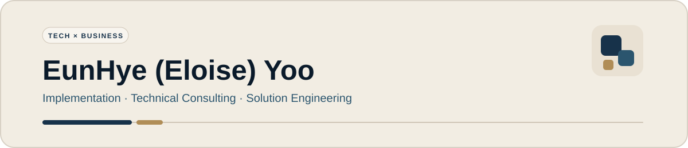

  

  <strong>사용자와 비즈니스의 문제를 요구사항으로 구조화하고, 기술·데이터·시스템 구현으로 연결합니다.</strong>

  
  
  
  

  <a href="./README.md">English</a>
  &nbsp;·&nbsp;
  <a href="https://github.com/Eunhye-yoo/EduPOP">EduPOP</a>
  &nbsp;·&nbsp;
  <a href="https://app.notion.com/p/Infrastructure-Lab-3dd1b198732a8059b1b1f2f410f08dc6?source=copy_link">Infrastructure Lab</a>

---

## 01 · About

**Java/Spring 애플리케이션, 데이터베이스, API, Linux, 네트워크·서버 환경**을 학습하고 직접 구현하며, 비즈니스 요구가 실제 동작하는 시스템으로 이어지는 과정을 익히고 있습니다.

IT 전환 전에는 교육 운영 현장에서 강사·학생·일정·고객 요구를 조율했습니다. 이 과정에서 운영상의 문제를 파악하고, 필요한 요구사항을 정리하며, 여러 이해관계자와 협업하는 경험을 쌓았습니다.

현재는 이러한 비즈니스 측 경험에 기술 구현 역량을 더해, **고객 문제를 분석하고 적절한 솔루션을 구성·구현하며 개발자와 협업해 실제 시스템으로 전달하는 역할**을 목표로 하고 있습니다.

| 현재 집중 분야 | 강점 |
| --- | --- |
| Implementation · Technical Consulting · Solution Engineering | 요구사항 구조화 · 이해관계자 조율 · 직접 구현 |
| IT / Technical Planning | 비즈니스 맥락 이해 · 데이터 흐름 사고 · 기술 커뮤니케이션 |

---

## 02 · Tech Stack

### 실제 프로젝트·실습에서 사용

### 현재 학습·실습 중

### Tools

---

## 03 · Selected Project

### [EduPOP](https://github.com/Eunhye-yoo/EduPOP)

> **학원 운영과 시험 결과를 다음 수업·학습 사이클로 연결하는 교육 플랫폼**

`Java` `Spring Boot` `MyBatis` `MySQL`

- **문제·요구사항 정의** — 초기 아이디어를 제안하고 학원 운영 및 학습상의 요구를 서비스 흐름과 핵심 기능으로 구체화
- **반 운영 기능 구현** — 반 생성·수정, 수강생 배정, 다중 강사 매핑, 중복 배정 방지, 정원 검증, 소유권 확인, Soft Delete 구현
- **3분 대시보드** — 반·학생별 성취도와 취약 영역을 분석하고 수업 전 확인할 위험 신호를 제공
- **개인 성적표** — 성적 추이와 강점·취약 영역을 시각화하고, 월간 리포트에서도 재사용할 수 있도록 분석 로직 구성

[프로젝트 README](https://github.com/Eunhye-yoo/EduPOP) · [Demo Video](https://youtu.be/mkAcPCD7VOY)

---

## 04 · Practice & Study

| Repository | 학습·실습 내용 |
| --- | --- |
| [Spring Boot Practice](https://github.com/Eunhye-yoo/springBoot_practice) | Spring MVC · Thymeleaf · Interceptor/AOP · JPA · QueryDSL |
| [React Practice](https://github.com/Eunhye-yoo/react_practice) | JavaScript · 컴포넌트 · Hooks · Router · 상태 관리 |
| [Servlet Practice](https://github.com/Eunhye-yoo/servlet_practice) | Servlet · JSP · JDBC · Session · 요청 흐름 |
| [Study Log](https://github.com/Eunhye-yoo/study_log) | Network · Routing · Server · IT 기초 |

---

## 05 · Certifications

- **네트워크관리사 2급** — 취득
- **정보처리기사** — 필기 합격
- **리눅스마스터 2급** — 필기 합격

---

## 06 · Infrastructure Lab

**Linux · Network · Server · Docker** 환경을 직접 구성하고, 설계–구축–검증 과정을 문서화하고 있습니다.

[Notion Infrastructure Lab](https://app.notion.com/p/Infrastructure-Lab-3dd1b198732a8059b1b1f2f410f08dc6?source=copy_link)

---

## 07 · Career Direction

**현재** → Implementation · Technical Consulting · Solution Engineering  
**다음 단계** → Solution Architecture · Technical Product  
**장기 방향** → AI 기반 제품 · Technical Business Leadership

기술과 고객, 비즈니스의 접점에서 성장하고자 하며, 먼저 **실제 고객·시스템 문제를 해결하는 실무 경험**을 탄탄히 쌓는 데 집중하고 있습니다.
